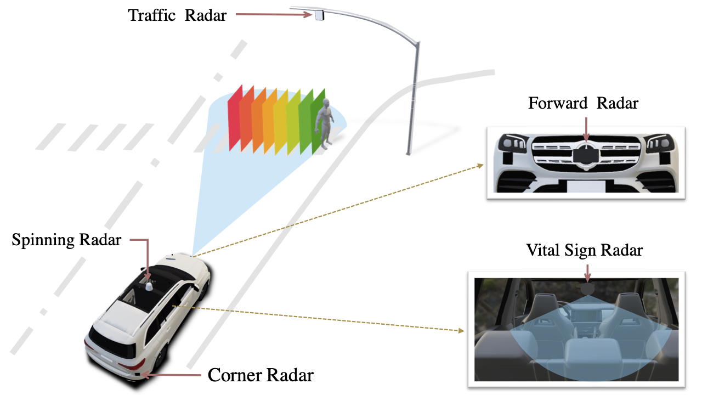
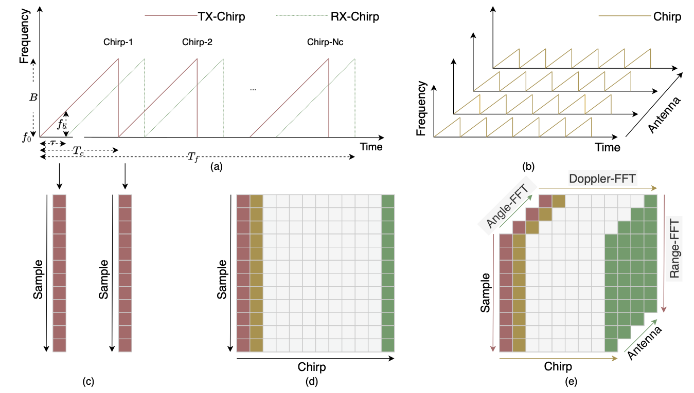
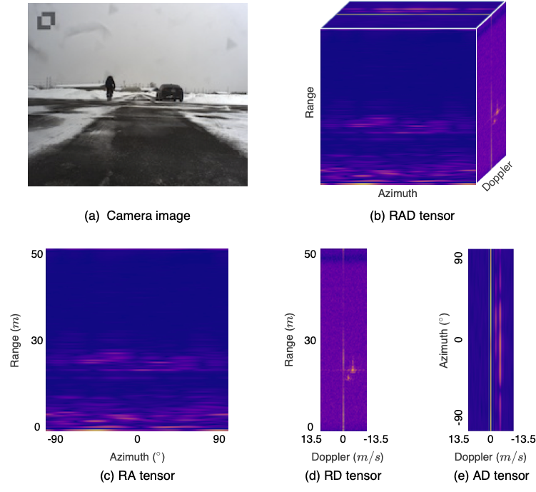
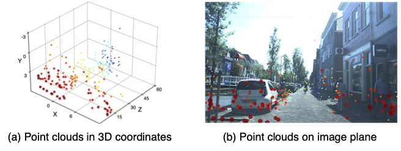
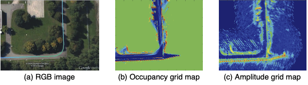
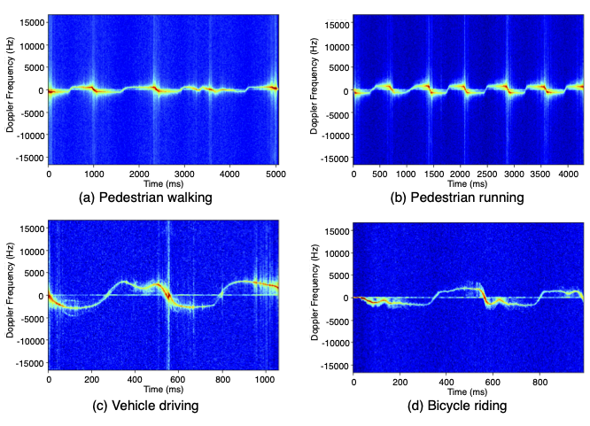

#  Awesome Radar Perception 

 

## Overview
- [Surveys](#surveys)
- [Datasets](#datasets)
- [Representations](#representations)
  - [ADC Signal](#adc-signal)
    - [Classification/Motion Recognition](#classificationmotion-recognition)
    - [Object Dection](#object-dection)
    - [Vital Sign](#vital-sign)
  - [Radar Tensor](#radar-tensor)
    - [Classification](#classification)
    - [Detection](#detection)
    - [Segmentation](#segmentation)
    - [Tracking](#tracking)
    - [Multi-Task](#multi-task)
  - [Point Cloud](#point-cloud)
    - [Classification](#classification)
    - [Detection](#detection-1)
    - [Segmentation](#segmentation-1)
    - [Tracking](#tracking-2)
    - [Scene Flow](#scene-flow)
    - [Odometry](#odometry)
    - [Gait Recognition](#gait-recognition)
  - [Grid Map](#grid-map)
    - [Detection](#detection-2)
    - [Segmentation](#segmentation-2)
  - [Micro-Doppler Signature](#micro-doppler-signature)
    - [Motion (Gait/Gestures/Activity) Classification](#motion-gaitgesturesactivity-classification)
- [Calibration](#calibration)
- [Citation](#citation)


## Surveys
* 2023 - Exploring Radar Data Representations in Autonomous Driving: A Comprehensive Review __`arXiv`__ [[Paper](https://arxiv.org/abs/2312.04861)] [[Website](https://radar-camera-fusion.github.io/radar)] [[GitHub](https://github.com/Radar-Camera-Fusion/Awesome-Radar-Perception)]
* 2023 - Radar-Camera Fusion for Object Detection and Semantic Segmentation in Autonomous Driving: A Comprehensive Review __`TIV`__ [[Paper](https://ieeexplore.ieee.org/document/10225711)] [[Website](https://radar-camera-fusion.github.io)] [[GitHub](https://github.com/Radar-Camera-Fusion/Awesome-Radar-Camera-Fusion)]
* 2023 - Reviewing 3D Object Detectors in the Context of High-Resolution 3+1D Radar __`CVPR Workshop`__ [[Paper](https://arxiv.org/abs/2308.05478)]
* 2023 - Radars for Autonomous Driving: A Review of Deep Learning Methods and Challenges __`ACCESS`__ [[Paper](https://ieeexplore.ieee.org/document/10242101)]
* 2023 - Vehicle Detection for Autonomous Driving: A Review of Algorithms and Datasets __`TITS`__ [[Paper](https://ieeexplore.ieee.org/abstract/document/10196355)]
* 2023 - An Overview of Algorithms for Contactless Cardiac Feature Extraction from Radar Signals: Advances and Challenges __`TIM`__ [[Paper](https://ieeexplore.ieee.org/document/10198368)]
* 2023 - 4D Millimeter-Wave Radar in Autonomous Driving: A Survey __`arXiv`__ [[Paper](https://arxiv.org/abs/2306.04242)] 
  
## Datasets
| Id | Name             | Year | Task                 | Data Representation               | Link                 |
|----|------------------|------|---------------------|-----------------------------------------|-------------------------|
| 1  | nuScenes         | 2019 | Object Detection<br>Object Tracking   | Point Cloud              | [Paper](https://www.nuscenes.org/nuscenes) [Website](https://www.nuscenes.org/nuscenes) [Github](https://github.com/nutonomy/nuscenes-devkit)                           |
| 2  | Astyx            | 2019 | Object Detection                                                   | Point Cloud                                                 | [Website](http://www.astyx.net)                                         |
| 3  | SeeingThroughFog | 2020 | Object Detection                                                | Point Cloud                                                 | [Website](https://www.uni-ulm.de/en/in/driveu/projects/dense-datasets/) |
| 4  | CARRADA          | 2020 | Object Detection<br>Semantic Segmentation<br>Object Tracking<br>Trajectory Prediction                     | Range-Doppler Tensor<br>Range-Azimuth Tensor                | [Website](https://arthurouaknine.github.io/codeanddata/carrada)                                                             |
| 5  | HawkEye          | 2020 | Semantic Segmentation               | Point Cloud                | [Website](https://jguan.page/HawkEye/)                                                             |
| 6  | Zendar           | 2020 | Object Detection<br>Mapping<br>Localization                  | Range-Doppler Tensor<br>Range-Azimuth Tensor<br>Point Cloud | [Website](http://zendar.io/dataset)                                 |
| 7  | RADIATE          | 2020 | Object Detection<br>Object Tracking<br>SLAM<br>Scene Understanding                                   | Range-Azimuth Tensor                                        | [Website](http://pro.hw.ac.uk/radiate/)                                                            |
| 8  | AIODrive         | 2020 | Object Detection<br>Object Tracking<br>Semantic Segmentation<br>Trajectory Prediction<br>Depth Estimation  | Point Cloud                                           | [Website](http://www.aiodrive.org/)                                                            |
| 9  | MulRan           | 2020 | Place Recognition  | Radar Tensor           | [Website](https://sites.google.com/view/mulran-pr)        |
| 10 | Oxford Radar RobotCar  | 2020 | Object Detection <br> Odometry  | Radar Tensor <br> Grid Map           | [Website](https://oxford-robotics-institute.github.io/radar-robotcar-dataset/)        |
| 11 | SCORP  | 2020 | Semantic Segmentation | Radar Tensor <br> Grid Map           | [Paper](https://ieeexplore.ieee.org/abstract/document/9299052/)        |
| 12 | CRUW             | 2021 | Object Detection  | Range-Azimuth Tensor             | [Website](https:/www.cruwdataset.org/)        |
| 13 | RaDICaL          | 2021 | Object Detection      | ADC Signal                        | [Website](https://publish.illinois.edu/radicaldata/)                     |
| 14 | RadarScenes | 2021 | Object Detection<br>Semantic Segmentation <br>Object Tracking   | Point Cloud                   |  [Website](https://radar-scenes.com/) |
| 15 | RADDet      | 2021 | Object Detection                 | Range-Azimuth-Doppler Tensor                                                                                              |  [Github](https://github.com/ZhangAoCanada/RADDet) |
| 16 | FloW        | 2021 | Object Detection     | Range-Doppler Tensor<br>Point Cloud  | [Website](https://orca-tech.cn/datasets/FloW/Introduction) [Github](https://github.com/ORCA-Uboat/FloW-Dataset)  |
| 17 | RADIal      | 2021 | Object Detection<br>Semantic Segmentation            | ADC Signal<br>Range-Azimuth-Doppler Tensor<br>Range-Azimuth Tensor<br>Range-Doppler Tensor<br>Point Cloud             |  [Github](https://github.com/valeoai/RADIal) |
| 18 | Pixset      | 2021 | Object Detection<br>Object Tracking         | Point Cloud         |  [Website](https://leddartech.com/solutions/leddar-pixset-dataset/) |
| 19 | Open Radar Datasets   | 2021 | Object Classification       | Micro-Doppler Signature         |  [Github](https://github.com/openradarinitiative/open_radar_datasets) |
| 20 | VoD         | 2022 | Object Detection                         | __`4D`__ Point Cloud                                             | [Website](https://tudelft-iv.github.io/view-of-delft-dataset/)  |
| 21 | Boreas      | 2022 | Object Detection<br>Localization<br>Odometry        | Range-Azimuth Tensor         |  [Website](https://www.boreas.utias.utoronto.ca/) |
| 22 | TJ4DRadSet  | 2022 | Object Detection<br>Object Tracking                | __`4D`__ Point Cloud                                                                                                               | [Website](https://github.com/TJRadarLab/TJ4DRadSet)  |
| 23 | K-Radar     | 2022 | Object Detection<br>Object Tracking<br>SLAM          | __`4D`__ Range-Azimuth-Doppler Tensor                 | [Github](https://github.com/kaist-avelab/k-radar)  |
| 24 | ColoRadar   | 2022 | Localization          | Radar Tensor <br> Point Cloud                | [Paper](https://arxiv.org/abs/2103.04510) [Website](https://arpg.github.io/coloradar/)  |
| 25 | aiMotive    | 2022 | Object Detection                                           | Point cloud                                                                          |  [Website](https://github.com/aimotive/aimotive_dataset) |
| 26 | WaterScenes    | 2023 | Instance Segmentation<br>Semantic Segmentation<br>Free-space Segmentation<br>Waterline Segmentation<br>Panoptic Perception             | __`4D`__ Point cloud                                                           |  [Paper](https://arxiv.org/abs/2307.06505) [Website](https://waterscenes.github.io) [GitHub](https://github.com/waterscenes/waterscenes) |
| 27 | ThermRad | 2023 | Object Detection| __`4D`__ Point Cloud | [Paper](https://arxiv.org/abs/2308.10161)|
| 28 | NTU4DRadLM | 2023 | SLAM | __`4D`__ Point Cloud | [Paper](https://arxiv.org/abs/2310.0760) [GitHub](https://github.com/adept-thu/Dual-Radar)|
| 29 | Dual Radar | 2023 | Object Detection<br>Object Tracking | __`4D`__ Point Cloud | [Paper](https://arxiv.org/abs/2310.0760) [GitHub](https://github.com/adept-thu/Dual-Radar)|
| 30 | MiliPoint | 2024 |  Activity Recognition | Point Cloud | [Paper](https://proceedings.neurips.cc/paper_files/paper/2023/hash/c60468eca9cd0b0083f0ff9d0aeb171a-Abstract-Datasets_and_Benchmarks.html) [GitHub](https://github.com/yizzfz/MiliPoint)|
| 31 | OORD | 2024 |  Place Recognition | Range-Azimuth Tensor | [Paper](https://arxiv.org/abs/2403.02845) [GitHub](https://github.com/mttgdd/oord-dataset)|

## Representations

### ADC Signal
 

#### Classification/Motion Recognition
* 2020 - Radar Image Reconstruction from Raw ADC Data using Parametric Variational Autoencoder with Domain Adaptation __`ICPR`__ [[Paper](https://ieeexplore.ieee.org/abstract/document/9412858)]
* 2021 - Improved Target Detection and Feature Extraction using a Complex-Valued Adaptive Sine Filter on Radar Time Domain Data __`EUSIPCO`__ [[Paper](https://ieeexplore.ieee.org/abstract/document/9616250)]
* 2021 - Data-Driven Radar Processing Using a Parametric Convolutional Neural Network for Human Activity Classification __`IEEE Sensors`__ [[Paper](https://ieeexplore.ieee.org/abstract/document/9464267)]
* 2021 - Spiking Neural Network-Based Radar Gesture Recognition System Using Raw ADC Data __`IEEE Sensors Letters`__ [[Paper](https://ieeexplore.ieee.org/abstract/document/9772332)]
* 2022 - Detection of Human Breathing in Non-Line-of-Sight Region by Using mmWave FMCW Radar __`TIM`__ [[Paper](https://ieeexplore.ieee.org/abstract/document/9897091)]
* 2023 - **CubeLearn**: End-to-End Learning for Human Motion Recognition From Raw mmWave Radar Signals __`IEEE IOT`__ [[Paper](https://ieeexplore.ieee.org/abstract/document/10018429)]


#### Object Dection
* 2023 - **ADCNet**: End-to-end perception with raw radar ADC data __`arXiv`__ [__`RADIal`__] [[Paper](https://arxiv.org/abs/2303.11420)]
* 2023 - **T-FFTRadNet**: Object Detection with Swin Vision Transformers from Raw ADC Radar Signals __`arXiv`__ [__`RADIal`__] [[Paper](https://arxiv.org/abs/2303.16940)]
* 2023 - **Echoes Beyond Points**: Unleashing the Power of Raw Radar Data in Multi-modality Fusion __`NeurIPS`__ [__`RADIal`__][[Paper](https://arxiv.org/abs/2307.16532)]
* 2023 - Azimuth Super-Resolution for FMCW Radar in Autonomous Driving __`CVPR`__ [__`RADIal`__] [[Paper](https://openaccess.thecvf.com/content/CVPR2023/html/Li_Azimuth_Super-Resolution_for_FMCW_Radar_in_Autonomous_Driving_CVPR_2023_paper.html)]


#### Vital Sign
* 2016 - RF-based child occupation detection in the vehicle interior __`IRS`__ [[Paper](https://ieeexplore.ieee.org/document/7497352)]
* 2019 - A Theoretical Investigation of the Detection of Vital Signs in Presence of Car Vibrations and RADAR-Based Passenger Classification __`TVT`__ [[Paper](https://ieeexplore.ieee.org/abstract/document/8638548)]
* 2020 - Non-Contact Vital Signs Monitoring for Multiple Subjects Using a Millimeter Wave FMCW Automotive Radar __`IMS`__ [[Paper](https://ieeexplore.ieee.org/abstract/document/9223838)]
* 2023 - Sparsity-Based Multi-Person Non-Contact Vital Signs Monitoring via FMCW Radar __`JBHI`__ [[Paper](https://ieeexplore.ieee.org/abstract/document/10065434)]
* 2023 - Radar-Based Monitoring of Vital Signs: A Tutorial Overview __`JPROC`__ [[Paper](https://ieeexplore.ieee.org/abstract/document/10049295)]


---
### Radar Tensor
 

#### Classification
* 2019 - Deep Learning-based Object Classification on Automotive Radar Spectra __`RadarConf`__ [[Paper](https://ieeexplore.ieee.org/abstract/document/8835775)]
* 2021 - **DeepHybrid**: Deep learning on automotive radar spectra and reflections for object classification __`ITSC`__ [[Paper](https://ieeexplore.ieee.org/abstract/document/8835775)]

#### Detection
* 2019 - Experiments with mmWave Automotive Radar Test-bed __`RA`__ __`ACSSC`__ [[Paper](https://ieeexplore.ieee.org/abstract/document/9048939)]
* 2019 - Vehicle Detection With Automotive Radar Using Deep Learning on Range-Azimuth-Doppler Tensors __`RAD`__ __`ICCV Workshop`__ [[Paper](https://ieeexplore.ieee.org/document/9022248)]
* 2020 - Probabilistic oriented object detection in automotive radar __`RA`__ __`CVPR Workshop`__ [[Paper](https://ieeexplore.ieee.org/document/9150751)]
* 2020 - **RODNet**: Radar Object Detection Using Cross-Modal Supervision __`RA`__  __`WACV`__ [__`CRUW`__] [[Paper](https://openaccess.thecvf.com/content/WACV2021/papers/Wang_RODNet_Radar_Object_Detection_Using_Cross-Modal_Supervision_WACV_2021_paper.pdf)]
* 2020 - **RODNet**: A Real-Time Radar Object Detection Network Cross-Supervised by Camera-Radar Fused Object 3D Localization __`RA`__ __`JSTSP`__  [__`CRUW`__] [[Paper](https://ieeexplore.ieee.org/document/9353210)]
* 2020 - Range-Doppler Detection in Automotive Radar with Deep Learning __`RD`__ __`IJCNN`__ [[Paper](https://ieeexplore.ieee.org/document/9207080)]
* 2020 - **RAMP-CNN**: A Novel Neural Network for Enhanced Automotive Radar Object Recognition __`RAD`__ __`IEEE Sensors`__ [[Paper](https://ieeexplore.ieee.org/abstract/document/9249018)]
* 2020 - CNN Based Road User Detection Using the 3D Radar Cube __`RAD`__ __`RAL`__ [[Paper](https://ieeexplore.ieee.org/abstract/document/8962258)]
* 2021 - [**GTR-Net**] Graph Convolutional Networks for 3D Object Detection on Radar Data __`RAD`__ __`ICCV Workshop`__ [[Paper](https://openaccess.thecvf.com/content/ICCV2021W/AVVision/html/Meyer_Graph_Convolutional_Networks_for_3D_Object_Detection_on_Radar_Data_ICCVW_2021_paper.html?ref=https://githubhelp.com)]
* 2021 - **RADDet**: Range-Azimuth-Doppler based Radar Object Detection for Dynamic Road Users __`RAD`__ __`CRV`__ [__`RADDet`__][[Paper](https://ieeexplore.ieee.org/document/9469418)] [[Code](https://github.com/ZhangAoCanada/RADDet)]
* 2022 - **DAROD**: A Deep Automotive Radar Object Detector on Range-Doppler maps __`RD`__ __`IV`__ [__`CARRADA`__ __`RADDet`__] [[Paper](https://ieeexplore.ieee.org/document/9827281)]
* 2022 - A recurrent CNN for online object detection on raw radar frames [__`CARRADA`__ __`CRUW`__] [[Paper](https://arxiv.org/abs/2212.11172)]
* 2022 - Radatron: Accurate Detection Using Multi-resolution Cascaded MIMO Radar __`ECCV`__ [[Paper](https://link.springer.com/chapter/10.1007/978-3-031-19842-7_10)]
* 2022 - **K-Radar**: 4D Radar Object Detection for Autonomous Driving in Various Weather Conditions __`RADE`__ __`NeurIPS`__ [__`K-Radar`__][[Paper](https://proceedings.neurips.cc/paper_files/paper/2022/hash/185fdf627eaae2abab36205dcd19b817-Abstract-Datasets_and_Benchmarks.html)] [[GitHub](https://github.com/kaist-avelab/k-radar)]
* 2023 - **Enhanced K-Radar**: Optimal Density Reduction to Improve Detection Performance and Accessibility of 4D Radar Tensor-based Object Detection __`RADE`__ __`arXiv`__ [__`K-Radar`__][[Paper](https://arxiv.org/abs/2303.06342)]
* 2023 - **YOLO-ORE**: A Deep Learning-Aided Object Recognition Approach for Radar Systems __`TVT`__ [[Paper](https://ieeexplore.ieee.org/abstract/document/9999316)]


#### Segmentation
* 2020 - **RSS-Net**: Weakly-supervised multi-class semantic segmentation with FMCW radar __`RAD`__ __`IV`__ [[Paper](https://ieeexplore.ieee.org/abstract/document/9304674)]
* 2020 - Deep Open Space Segmentation using Automotive Radar __`RAD`__ __`ICMIM`__ [[Paper](https://ieeexplore.ieee.org/abstract/document/9299052)]
* 2021 - **PolarNet**: Accelerated Deep Open Space Segmentation using Automotive Radar in Polar Domain  __`RAD`__ __`VEHITS`__ [[Paper](https://arxiv.org/abs/2103.03387)]
* 2021 - Multi-view Radar Semantic Segmentation __`RAD`__ __`ICCV`__ [[Paper](https://openaccess.thecvf.com/content/ICCV2021/html/Ouaknine_Multi-View_Radar_Semantic_Segmentation_ICCV_2021_paper.html)] [[GitHub](https://github.com/valeoai/MVRSS)]
* 2024 - **TransRadar**: Adaptive-Directional Transformer for Real-Time Multi-View Radar Semantic Segmentation __`RAD`__ __`WACV`__ [[Paper](https://openaccess.thecvf.com/content/WACV2024/html/Dalbah_TransRadar_Adaptive-Directional_Transformer_for_Real-Time_Multi-View_Radar_Semantic_Segmentation_WACV_2024_paper.html)] [[GitHub](https://github.com/YahiDar/TransRadar)]

#### Tracking
* 2022 - Exploiting Temporal Relations on Radar Perception for Autonomous Driving  __`CVPR`__ [[Paper](https://arxiv.org/abs/2204.01184)]

#### Multi-Task
* 2022 - [**FFT-RadNet**] Raw High-Definition Radar for Multi-Task Learning __`CVPR`__ [__`RADIal`__] [[Paper](https://openaccess.thecvf.com/content/CVPR2022/html/Rebut_Raw_High-Definition_Radar_for_Multi-Task_Learning_CVPR_2022_paper.html)]
* 2023 - Cross-Modal Supervision-Based Multitask Learning With Automotive Radar Raw Data  __`RD`__ __`TIV`__ [__`RADIal`__][[Paper](https://ieeexplore.ieee.org/abstract/document/10008067)]

---
### Point Cloud
 

#### Classification
* 2017 - Comparison of random forest and long short-term memory network performances in classification tasks using radar __`SDF`__ [[Paper](https://ieeexplore.ieee.org/abstract/document/8126350)]
* 2018 - Radar-based Feature Design and Multiclass Classification for Road User Recognition __`IV`__ [[Paper](https://ieeexplore.ieee.org/abstract/document/8500607)]
* 2020 - Off-the-shelf sensor vs. experimental radar - How much resolution is necessary in automotive radar classification? __`FUSION`__ [[Paper](https://ieeexplore.ieee.org/abstract/document/9190338)]
* 2022 - **Radar-PointGNN**: Graph Based Object Recognition for Unstructured Radar Point-cloud Data __`RadarConf`__ [[Paper](https://ieeexplore.ieee.org/abstract/document/9455172)]


#### Detection
* 2019 - 2D Car Detection in Radar Data with PointNets __`ITSC`__ [[Paper](https://ieeexplore.ieee.org/abstract/document/8917000)]
* 2020 - Detection and Tracking on Automotive Radar Data with Deep Learning __`FUSION`__ [[Paper](https://ieeexplore.ieee.org/abstract/document/9190261)]
* 2020 - Seeing Around Street Corners: Non-Line-of-Sight Detection and Tracking In-the-Wild Using Doppler Radar __`CVPR`__ [[Paper](https://openaccess.thecvf.com/content_CVPR_2020/html/Scheiner_Seeing_Around_Street_Corners_Non-Line-of-Sight_Detection_and_Tracking_In-the-Wild_Using_CVPR_2020_paper.html)]
* 2021 - **RPFA-Net**: a 4D RaDAR Pillar Feature Attention Network for 3D Object Detection __`ITSC`__ [[Paper](https://ieeexplore.ieee.org/abstract/document/9564754)] [[Code](https://github.com/adept-thu/RPFA-Net)]
* 2021 - Comparison of Different Approaches for Identification of Radar Ghost Detections in Automotive Scenarios __`RadarConf`__ [[Paper](https://ieeexplore.ieee.org/document/9454980)]
* 2022 - Contrastive Learning for Automotive mmWave Radar Detection Points Based Instance Segmentation __`ITSC`__ [[Paper](https://ieeexplore.ieee.org/document/9922540)]
* 2023 - 3-D Object Detection for Multiframe 4-D Automotive Millimeter-Wave Radar Point Cloud __`IEEE Sensors`__ [__`TJ4DRadSet`__][[Paper](https://ieeexplore.ieee.org/abstract/document/9944629)]
* 2023 - **SMURF**: Spatial Multi-Representation Fusion for 3D Object Detection with 4D Imaging Radar __`TIV`__ [__`VoD`__ __`TJ4DRadSet`__][[Paper](https://ieeexplore.ieee.org/abstract/document/10274127)]
* 2023 - **MVFAN**: Multi-View Feature Assisted Network for 4D Radar Object Detection __`ICONIP`__ [__`Astyx`__ __`VoD`__] [[Paper](https://arxiv.org/abs/2310.16389)]
* 2023 - **See Beyond Seeing**: Robust 3D Object Detection from Point Clouds via Cross-Modal Hallucination [__`VoD`__] [[Paper](https://arxiv.org/abs/2309.17336)]
* 2024 - **DenserRadar**: A 4D millimeter-wave radar point cloud detector based on dense LiDAR point clouds [__`K-Radar`__] [[Paper](https://arxiv.org/abs/2405.05131)]

#### Segmentation
* 2018 - Semantic Segmentation on Radar Point Clouds __`FUSION`__ [[Paper](https://ieeexplore.ieee.org/document/8455344)]
* 2018 - Supervised Clustering for Radar Applications: On the Way to Radar Instance Segmentation __`ICMIM`__ [[Paper](https://ieeexplore.ieee.org/document/8443534)]
* 2019 - 2D Car Detection in Radar Data with PointNets __`ITSC`__ [[Paper](https://ieeexplore.ieee.org/abstract/document/8917000)]
* 2020 - **RSS-Net**: Weakly-Supervised Multi-Class Semantic Segmentation with FMCW Radar __`IV`__ [[Paper](https://ieeexplore.ieee.org/abstract/document/9304674)]
* 2022 - Panoptic Segmentation for Automotive Radar Point Cloud __`RadarConf`__ [[Paper](https://ieeexplore.ieee.org/document/9764218)]
* 2023 - Deep Instance Segmentation With Automotive Radar Detection Points __`TIV`__ [__`RadarScenes`__] [[Paper](https://ieeexplore.ieee.org/abstract/document/9762032)]

<!-- Point cloud segmentation with a high-resolution automotive radar __``__ [[Paper](https://ieeexplore.ieee.org/document/8727840)] -->
<!-- Kernel point convolution LSTM networks for radar point cloud segmentation __`Applied Science`__ -->

#### Tracking
* 2020 - Detection and Tracking on Automotive Radar Data with Deep Learning __`FUSION`__ [[Paper](https://ieeexplore.ieee.org/abstract/document/9190261)]
* 2023 - Which Framework is Suitable for Online 3D Multi-Object Tracking for Autonomous Driving with Automotive 4D Imaging Radar? __`arXiv`__ [[Paper](https://arxiv.org/abs/2309.06036)]
* 2024 - **RaTrack**: Moving Object Detection and Tracking with 4D Radar Point Cloud __`ICRA`__ [__`VoD`__] [[Paper](https://arxiv.org/abs/2309.09737)] [[Code](https://github.com/ljacksonpan/ratrack)]

#### Scene Flow
* 2022 - Self-Supervised Scene Flow Estimation With 4-D Automotive Radar __`RAL`__ [[Paper](https://ieeexplore.ieee.org/abstract/document/9810356) [Code](https://github.com/Toytiny/RaFlow)]
* 2023 - **Hidden Gems**: 4D Radar Scene Flow Learning Using Cross-Modal Supervision-Supplementary Material __`CVPR`__ [__`VoD`__] [[Paper](https://openaccess.thecvf.com/content/CVPR2023/html/Ding_Hidden_Gems_4D_Radar_Scene_Flow_Learning_Using_Cross-Modal_Supervision_CVPR_2023_paper.html) [Code](https://github.com/Toytiny/CMFlow)]

#### Odometry
* 2023 - Efficient Deep-Learning 4D Automotive Radar Odometry Method __`TIV`__ [[Paper](https://ieeexplore.ieee.org/abstract/document/10237296)]
* 2023 - **DRIO**: Robust Radar-Inertial Odometry in Dynamic Environments __`RAL`__ [[Paper](https://ieeexplore.ieee.org/abstract/document/10207713)]

#### Gait Recognition
* 2021 - Person Reidentification Based on Automotive Radar Point Clouds __`TGRS`__ [[Paper](https://ieeexplore.ieee.org/document/9420713)]
* 2020 - Gait Recognition for Co-Existing Multiple People Using Millimeter Wave Sensing __`AAAI`__ [[Paper](https://ojs.aaai.org/index.php/AAAI/article/view/5430)]

---
### Grid Map
 

#### Detection
* 2015 - Automotive Radar Gridmap Representations __`ICMIM`__ [[Paper](https://ieeexplore.ieee.org/abstract/document/7117922)]
* 2015 - Detection of Arbitrarily Rotated Parked Cars Based on Radar Sensors __`IRS`__ [[Paper](https://ieeexplore.ieee.org/abstract/document/7226281)]
* 2016 - 3D Occupancy Grid Mapping Using Statistical Radar Models __`IV`__ [[Paper](https://ieeexplore.ieee.org/abstract/document/7535495)]
* 2017 - Semantic Radar Grids __`IV`__ [[Paper](https://ieeexplore.ieee.org/abstract/document/7995871)]
* 2018 - Adaptions for Automotive Radar Based Occupancy Gridmaps __`ICMIM`__ [[Paper](https://ieeexplore.ieee.org/abstract/document/8443484)]
* 2018 - High Resolution Radar-based Occupancy Grid Mapping and Free Space Detection __`VEHITS`__ [[Paper](https://pdfs.semanticscholar.org/d888/6334e15acebe688f993f45da7ba7bde79eff.pdf)]
* 2019 - Semantic Segmentation on Automotive Radar Maps __`IV`__ [[Paper](https://ieeexplore.ieee.org/abstract/document/8813808)]
* 2019 - Occupancy Grids Generation Using Deep Radar Network for Autonomous Driving __`ITSC`__ [[Paper](https://ieeexplore.ieee.org/abstract/document/8916897)]
* 2020 - Semantic Segmentation on 3D Occupancy Grids for Automotive Radar __`IEEE ACCESS`__ [[Paper](https://ieeexplore.ieee.org/abstract/document/9229096)]
* 2023 - **NVRadarNet**: Real-Time Radar Obstacle and Free Space Detection for Autonomous Driving __`RA`__ __`ICRA`__ [[Paper](https://arxiv.org/abs/2209.14499)]


#### Segmentation
* 2019 - Road Scene Understanding by Occupancy Grid Learning from Sparse Radar Clusters using Semantic Segmentation __`ICCV Workshop`__ [[Paper](https://openaccess.thecvf.com/content_ICCVW_2019/html/CVRSUAD/Sless_Road_Scene_Understanding_by_Occupancy_Grid_Learning_from_Sparse_Radar_ICCVW_2019_paper.html)]
* CNN based road course estimation on automotive radar data with various gridmaps __`ICMIM`__ [[Paper](https://ieeexplore.ieee.org/document/9299086)]
* 2020 - Scene Understanding With Automotive Radar __`TIV`__ [[Paper](https://ieeexplore.ieee.org/abstract/document/8911477)]
* 2023 - Semantic Segmentation-Based Occupancy Grid Map Learning With Automotive Radar Raw Data __`TIV`__ [__`RADIal`__][[Paper](https://ieeexplore.ieee.org/abstract/document/10273590)]

---
### Micro-Doppler Signature
 

#### Motion (Gait/Gestures/Activity) Classification
* 2016 - Human Detection and Activity Classification Based on Micro-Doppler Signatures Using Deep Convolutional Neural Networks __`IEEE Geoscience and Remote Sensing Letters`__ [[Paper](https://ieeexplore.ieee.org/abstract/document/7314905)]
* 2017 - New Analysis of Radar Micro-Doppler Gait Signatures for Rehabilitation and Assisted Living __`ICASSP`__ [[Paper](https://ieeexplore.ieee.org/abstract/document/7952908)]
* 2018 - Human Motion Classification with Micro-Doppler Radar and Bayesian-Optimized Convolutional Neural Networks __`ICASSP`__ [[Paper](https://ieeexplore.ieee.org/abstract/document/8461847)]
* 2018 - Radar-Based Human-Motion Recognition With Deep Learning: Promising Applications for Indoor Monitoring __`IEEE Signal Processing Magazine`__ [[Paper](https://ieeexplore.ieee.org/abstract/document/8746862)]
* 2019 - Radar-Based Human Gait Recognition Using Dual-Channel Deep Convolutional Neural Network __`TGRS`__ [[Paper](https://ieeexplore.ieee.org/abstract/document/8789686)]
* 2019 - Experiments with mmWave Automotive Radar Test-bed __`ACSSC`__ [[Paper](https://ieeexplore.ieee.org/abstract/document/9048939)]
* 2022 - Attention-Based Dual-Stream Vision Transformer for Radar Gait Recognition __`ICASSP`__ [[Paper](https://ieeexplore.ieee.org/abstract/document/9746565)]
 <!-- Doppler-radar based hand gesture recognition system using convolutional neural networks -->
 <!-- Practical classification of different moving targets using automotive radar and deep neural networks -->

## Calibration
* 2019 - Extrinsic 6DoF calibration of a radar–LiDAR–camera system enhanced by radar cross section estimates evaluation [[Paper](https://www.sciencedirect.com/science/article/pii/S0921889018301994)]
* 2021 - A Joint Extrinsic Calibration Tool for Radar, Camera and Lidar __`TIV`__ [[Paper](https://ieeexplore.ieee.org/abstract/document/9380784)]
* 2021 - 3D Detection and Tracking for On-road Vehicles with a Monovision Camera and Dual Low-cost 4D mmWave Radars __`ITSC`__ [[Paper](https://ieeexplore.ieee.org/abstract/document/9564904)]
* 2022 - **3DRadar2ThermalCalib**: Accurate Extrinsic Calibration between a 3D mmWave Radar and a Thermal Camera Using a Spherical-Trihedral __`ITSC`__ [[Paper](https://ieeexplore.ieee.org/abstract/document/9922522)]
* 2022 - **K-Radar**: 4D Radar Object Detection for Autonomous Driving in Various Weather Conditions  __`NeurIPS`__ [[Paper](https://proceedings.neurips.cc/paper_files/paper/2022/hash/185fdf627eaae2abab36205dcd19b817-Abstract-Datasets_and_Benchmarks.html)] [[GitHub](https://github.com/kaist-avelab/k-radar)]

## Citation
Please use the following citation when referencing
```
@misc{yao2023radarperception,
      title={Exploring Radar Data Representations in Autonomous Driving: A Comprehensive Review}, 
      author={Shanliang Yao and Runwei Guan and Zitian Peng and Chenhang Xu and Yilu Shi and Weiping Ding and Eng Gee Lim and Yong Yue and Hyungjoon Seo and Ka Lok Man and Jieming Ma and Xiaohui Zhu and Yutao Yue},
      year={2023},
      eprint={2312.04861},
      archivePrefix={arXiv},
      primaryClass={cs.CV}
}
```
